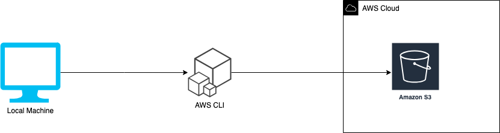

# CloudUploader

Cloud Uploader is a CLI tool for uploading any type of files to AWS S3.


### How it works?




### Prerequisites

1. AWS cli installed on your local machine 
2. An aws profile with access token and secret key that needs to be authenticated with your local cli
3. An AWS S3 Bucket

### Configuration File 

The script requires a yaml configuration file to upload files to any S3 bucket. The configuration file must have the yaml extension.

#### Configuration To Upload Multiple Files

```
config:
    service: s3
    localFilePath: <path to multiple files>
    bucket: <s3 Bucket Name>
    isMultipleFiles: <Set to true when uploading multiple files>
```
#### Example Of Configuration Files for Multiple File Upload

```
config:
    service: s3
    localFilePath: ../../reciepts
    bucket: september-reciepts
    isMultipleFiles: true
```


#### Configuration To Upload A Single File

```
config:
    service: s3
    localFilePath: <path to single files>
    fileName: <file name>
    bucket: <s3 Bucket Name>
    isMultipleFiles: <Set to false when uploading multiple files>
```
#### Example Of Configuration Files for Multiple File Upload

```
config:
     service: s3
    localFilePath: ../../reciepts/september.json
    fileName: september.json
    bucket: september-reciepts
    isMultipleFiles: false
```


### Upload To S3
You can upload a single file or multiple files by executing the following command:

```
 bash upload.sh <path to configuration file>
```


   
